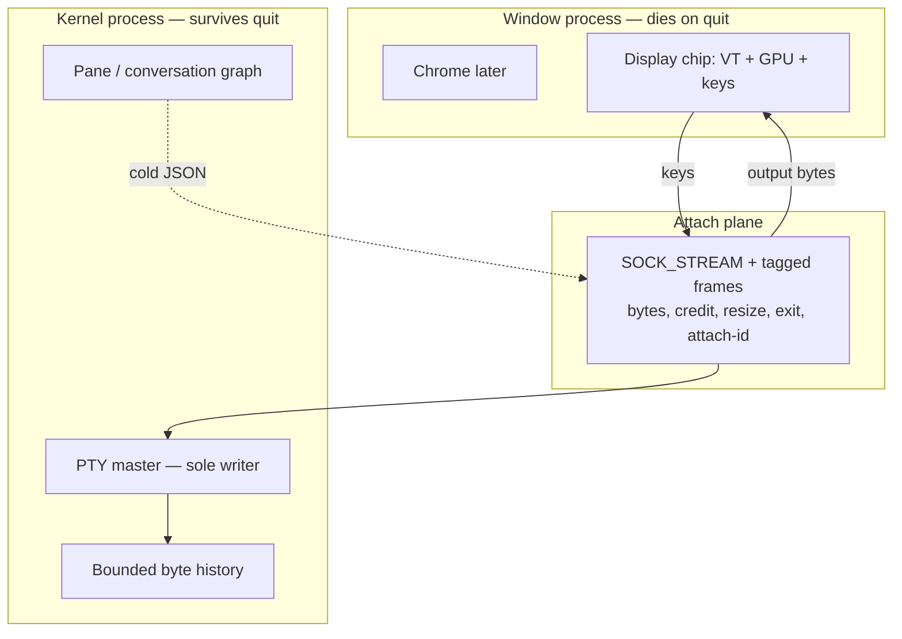

# RILL

A session operating system for terminals. macOS first. MIT OR Apache-2.0.

**Spike 0 is not done.** This repository is the charter: product, architecture, contracts, and GitHub process. There is no running window yet. Do not add agents, Blocks, or chrome until Spike 0 is butter.

## In one page

| Word | Meaning |
|---|---|
| **Kernel** | The session OS. Owns shells, IDs, journal, who may type where. Lives after you quit the window. |
| **PTY** | The Unix pipe to `zsh` / `vim` / `claude`. The kernel owns the master end. Nothing else writes it. |
| **Attach plane** | Framed bytes between the window and the kernel (keys in, output out). Not JSON. Not cells. |
| **UI / display chip** | What you see and type into. Lives in the window process. Dies on quit. Chip 0 = `libghostty-vt` + our GPU. Chip 1 = our emulator later, same traits. |
| **Scrollback** | Byte history in the **kernel**, not in the window. Quit does not destroy it. |
| **Orchestration** | Later: conversations, agents, scheduler. JSON and cold. Never on the typing path. |

Warm typing never touches JSON, cell dumps, or the graph.

## Start here

1. [PRD](docs/PRD.md) — what we ship and what we refuse
2. [Architecture](docs/ARCHITECTURE.md) — planes, contracts, diagrams
3. [ADR 0001](docs/adr/0001-session-operating-system.md) — the lock
4. [Spike 0](docs/SPIKE-0.md) — named gates; **not implemented**
5. [Lanes](docs/LANES.md) — how 3–5 people work in parallel
6. [CONTRIBUTING](CONTRIBUTING.md) — issues, PRs, TDD

## License

[MIT](LICENSE-MIT) or [Apache-2.0](LICENSE-APACHE-2.0), at your option.
The app does not require an account to type. Monetization is not specified in this tree.
