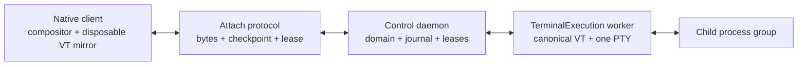

# RILL

A persistent host runtime and native content system for terminals. macOS first.
MIT OR Apache-2.0.

**Spike 0 is GREEN** ([ADR 0010](docs/adr/0010-spike-0-closes.md)). Kernel,
attach, Chip 1 (`vt-engine`), and a packaged `Rill.app` exist. Chip 0 /
libghostty-vt is retired ([ADR 0054](docs/adr/0054-chip0-retired.md)).

Milestone 1 first slice is **Proven** ([ADR 0014](docs/adr/0014-m1-first-slice-closes.md)).
Persist remainder is [ADR 0015](docs/adr/0015-m1-persist-remainder.md).
Do not add agents, Blocks, or chrome to hide a later NFR miss. Run `make gates`
for regression. Launch the window with `make run`.

**Shipped vs specified.** The packaged window is three-pane AppKit chrome around
one Metal `TerminalView`. Chip 1 runs **in the GUI process** on protocol 1.
The worker owns the PTY and byte ring. Worker-canonical VT, protocol 2
checkpoint/delta, OSC, domain graph, Flow and compositor are specified and
**not shipped** — see [DEFERRED](docs/DEFERRED.md) and
[#338](https://github.com/mahboobmonnamd/RILL/issues/338).

## In one page

| Word | Meaning |
|---|---|
| **Runtime** | The per-user service on the process-owning host. Owns durable domain state, workers, leases and recovery. Lives after clients quit. |
| **Workspace / Session** | Stable durable grouping. The objects remain real when their management UI is hidden. Session is not a PTY. |
| **Terminal pane / execution** | A terminal pane owns at most one TerminalExecution. That execution worker owns one PTY and child process group. `Leaf` is internal tree terminology. |
| **Attach plane** | Versioned framed bytes, checkpoints, credit and leases between clients and the runtime. The warm path is not JSON or cells. |
| **Terminal core / display** | Host canonical VT (`vt-engine`) plus disposable client mirrors. Metal remains the terminal primitive. |
| **ContentTimeline** | Typed primary terminal/agent content and transcript under explicit retention policy. Raw replay is recovery/audit, not normal content identity. |
| **Conversation / Task** | Structured orchestration objects attached to domain IDs. Neither is Session, TerminalExecution or transcript. |
| **Shell compatibility** | zsh, fish, bash and other PTY-compatible shells keep their existing prompts, themes, plugins, startup files, ANSI behavior and interactive semantics. |
| **Configuration / privacy** | One versioned TOML model covers product settings; portable copies exclude credentials. Sensitive content is minimized, policy-gated, encrypted and isolated. |



Warm typing remains raw bytes to an in-process client VT and POD damage to the
Metal grid. It never touches JSON, per-cell strings, ContentTimeline
serialization or control-plane RPC. The mermaid above is the **product**
control plane; the GUI does not yet attach protocol 2 or hold a disposable
mirror of a worker-canonical VT.

## Setup

```sh
make setup
make run
```

Installs or checks Rust (`rustc` ≥ 1.85) and Xcode Command Line Tools. No Zig.

## Start here

1. [ADR 0010](docs/adr/0010-spike-0-closes.md) — Spike 0 is Proven
2. [PRD](docs/PRD.md) — what we ship and what we refuse
3. [Architecture](docs/ARCHITECTURE.md) — planes, contracts, diagrams
4. [ADR 0054](docs/adr/0054-chip0-retired.md) — Chip 1 is live; Chip 0 retired
5. [Deferred](docs/DEFERRED.md) — specified product work that is not in the binary ([#338](https://github.com/mahboobmonnamd/RILL/issues/338))
6. [ADR 0053](docs/adr/0053-runtime-domain-content-and-client-authority.md) — runtime, domain, content and client authority
7. [ADR 0057](docs/adr/0057-cli-agent-integration-architecture.md) — terminal-first CLI-agent integration architecture
8. [Architecture evidence](docs/ARCHITECTURE-EVIDENCE-2026-08-21.md) — repository findings and workflow sources
9. [ADR registry](docs/adr/README.md) — canonical numbering and historical mappings
9. [ADR 0001](docs/adr/0001-session-operating-system.md) — the lock
10. [ADR 0002](docs/adr/0002-falsifiable-evidence.md) — what counts as evidence
11. [ADR 0003](docs/adr/0003-display-pipeline.md) — renderer and key→present
12. [Foundation specs](docs/spec/) — [domain/lifecycle](docs/spec/SPEC-DOMAIN-LIFECYCLE.md), [runtime](docs/spec/SPEC-RUNTIME-SUPERVISION.md), [clients](docs/spec/SPEC-CLIENT-AUTHORITY.md), [content](docs/spec/SPEC-CONTENT.md), [compositor](docs/spec/SPEC-COMPOSITOR.md)
13. [Spike 0](docs/SPIKE-0.md) — named gates ([validation](docs/SPIKE-0-VALIDATION.md), [test cases](docs/TEST-CASES.md))
14. [Existing subsystem specs](docs/spec/) — [kernel](docs/spec/SPEC-KERNEL.md), [attach](docs/spec/SPEC-ATTACH.md), [chip 0](docs/spec/SPEC-CHIP0.md), [display](docs/spec/SPEC-DISPLAY.md), [graph](docs/spec/SPEC-GRAPH.md), [chrome](docs/spec/SPEC-CHROME.md), [remote](docs/spec/SPEC-REMOTE.md), [chip 1](docs/spec/SPEC-CHIP1.md)
15. [ADR 0011](docs/adr/0011-session-graph.md) / [ADR 0014](docs/adr/0014-m1-first-slice-closes.md) / [ADR 0015](docs/adr/0015-m1-persist-remainder.md) — Milestone 1
16. [ADR 0012](docs/adr/0012-chip1-isolated-vt.md) / [M4-HANDOFF](docs/M4-HANDOFF.md) / [M4-PLAN](docs/M4-PLAN.md) — isolated Chip 1; live swap parked behind checkpoint compatibility
17. [Lanes](docs/LANES.md) — dependency order and parallel ownership
18. [CONTRIBUTING](CONTRIBUTING.md) — issues, PRs, TDD

## License

[MIT](LICENSE-MIT) or [Apache-2.0](LICENSE-APACHE-2.0), at your option.
The app does not require an account to type. Monetization is not specified in this tree.
