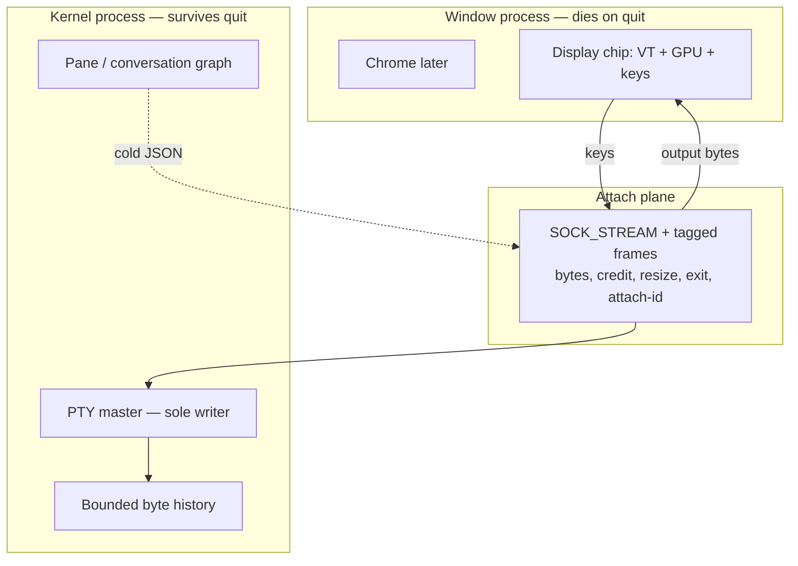

# RILL

A session operating system for terminals. macOS first. MIT OR Apache-2.0.

**Spike 0 is GREEN** ([ADR 0010](docs/adr/0010-spike-0-closes.md)). Kernel,
attach, Chip 0, and a packaged `Rill.app` exist. Every named gate is Proven:
library suite in [run 31993832263](https://github.com/mahboobmonnamd/RILL/actions/runs/31993832263),
T-NFR on packaged battery hid. The 2026-08-16 marks remain withdrawn; read
[SPIKE-0-AUDIT](docs/SPIKE-0-AUDIT.md) before citing that day's numbers.

Milestone 1 may open. Do not add agents, Blocks, or chrome to hide a later NFR
miss. Run `make gates` for regression.

## In one page

| Word | Meaning |
|---|---|
| **Kernel** | The session OS. Owns shells, IDs, journal, who may type where. Lives after you quit the window. |
| **PTY** | The Unix pipe to `zsh` / `vim` / `claude`. The kernel owns the master end. Nothing else writes it. |
| **Attach plane** | Framed bytes between the window and the kernel (keys in, output out). Not JSON. Not cells. |
| **UI / display chip** | What you see and type into. Lives in the window process. Dies on quit. Chip 0 = `libghostty-vt` + our GPU. Chip 1 = our emulator later, same traits. |
| **Scrollback** | Byte history in the **kernel**, not in the window. Quit does not destroy it. |
| **Orchestration** | Later: conversations, agents, scheduler. JSON and cold. Never on the typing path. |



Warm typing never touches JSON, cell dumps, or the graph.

## Setup

```sh
make setup
```

Installs or checks Rust (`rustc` ≥ 1.85), Zig (≥ 0.16, for Chip 0 / `libghostty-vt` only), and Xcode Command Line Tools. Then fetches Ghostty source as a build-time dep and builds the VT library — not Ghostty.app. `third_party/ghostty` is gitignored.

## Start here

1. [SPIKE-0-AUDIT](docs/SPIKE-0-AUDIT.md) — **read first**: what the green marks actually meant
2. [PRD](docs/PRD.md) — what we ship and what we refuse
3. [Architecture](docs/ARCHITECTURE.md) — planes, contracts, diagrams
4. [ADR 0001](docs/adr/0001-session-operating-system.md) — the lock
5. [ADR 0002](docs/adr/0002-falsifiable-evidence.md) — what counts as evidence
6. [ADR 0003](docs/adr/0003-display-pipeline.md) — renderer and key→present
7. [Spike 0](docs/SPIKE-0.md) — named gates, **Proven** ([validation](docs/SPIKE-0-VALIDATION.md), [test cases](docs/TEST-CASES.md), [ADR 0010](docs/adr/0010-spike-0-closes.md))
8. [Specs](docs/spec/) — [kernel](docs/spec/SPEC-KERNEL.md), [attach](docs/spec/SPEC-ATTACH.md), [chip 0](docs/spec/SPEC-CHIP0.md), [display](docs/spec/SPEC-DISPLAY.md)
9. [Lanes](docs/LANES.md) — how 3–5 people work in parallel
10. [CONTRIBUTING](CONTRIBUTING.md) — issues, PRs, TDD

## License

[MIT](LICENSE-MIT) or [Apache-2.0](LICENSE-APACHE-2.0), at your option.
The app does not require an account to type. Monetization is not specified in this tree.
