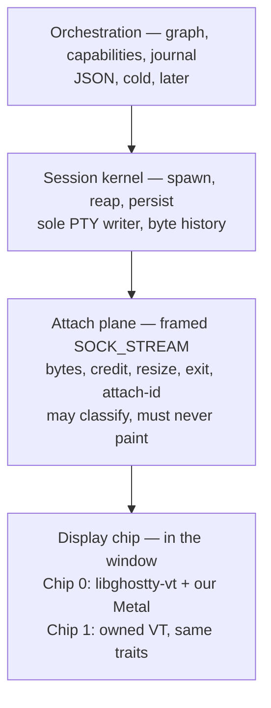
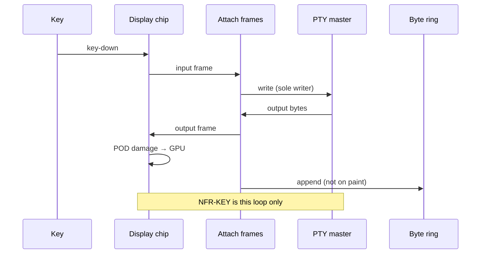
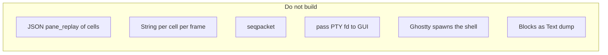

# Architecture

Authority: [ADR 0001](adr/0001-session-operating-system.md). Spike 0 closed:
[ADR 0010](adr/0010-spike-0-closes.md). Session graph: [ADR 0011](adr/0011-session-graph.md).
Chip 1 isolated crate: [ADR 0012](adr/0012-chip1-isolated-vt.md) ([M4-HANDOFF](M4-HANDOFF.md)).
Cwd tap: [ADR 0013](adr/0013-cwd-tap.md). M1 first slice: [ADR 0014](adr/0014-m1-first-slice-closes.md).
This file is the map. It does not authorize code by itself.

## Four planes



| Plane | Owns | Must not |
|---|---|---|
| Orchestration | IDs, tasks, later agents | Carry PTY bytes or cells |
| Kernel | PTY master, reap, byte ring | Paint, spawn from the GUI |
| Attach | Framing, credit, order, one attach-id | Drop live bytes; `SCM_RIGHTS` the master |
| Display | VT, GPU, IME, mouse | `posix_spawn` the user shell; own scrollback |

## Warm path vs cold path



Resync (once per attach): kernel asks the **same** chip, headless, to emit a byte repaint from history. The window cannot tell resync bytes from live bytes. That path is forbidden on a warm keystroke.

## Chip swap

```text
TerminalEmulation   bytes in, size, mouse flags, alt-screen, feed, resize
TerminalPresenting  apply POD snapshot / damage; sendBytes callback
```

Chip 0 and Chip 1 both implement those traits. Domain UI must not name Ghostty types. Full Ghostty exec (library that spawns the shell) is rejected as an intermediate.

## Attach frame (normative sketch)

Not JSON. One tag byte + length + payload. Minimum tags for Spike 0:

| Tag | Direction | Payload |
|---|---|---|
| `DATA` | both | raw bytes |
| `CREDIT` | GUI → kernel | window of bytes the GUI can take |
| `RESIZE` | GUI → kernel | cols, rows, px; kernel `TIOCSWINSZ` in this order relative to DATA |
| `EXIT` | kernel → GUI | status; pane is dead |
| `ATTACH` | GUI → kernel | generation token; second attach → refuse |
| `REFUSED` | kernel → GUI | reason |

Kernel never `try_send`s PTY output into a dropping channel. If the GUI is slow, stop reading the master (real backpressure). Do not stall other panes when they exist.

## Classifier vs renderer

The attach plane may watch the byte stream for alt-screen, OSC 52 (deny until policy UI), OSC 9/title, OSC 133, OSC 7, child exit. It journals events. It never builds a grid the GUI consumes. OSC 7 is not the cwd tap ([ADR 0013](adr/0013-cwd-tap.md)).

A second live VT in the kernel is forbidden. A headless Chip 0 used **only** for resync bytes is the same implementation, cold path, not a second parser.

## What this is not


