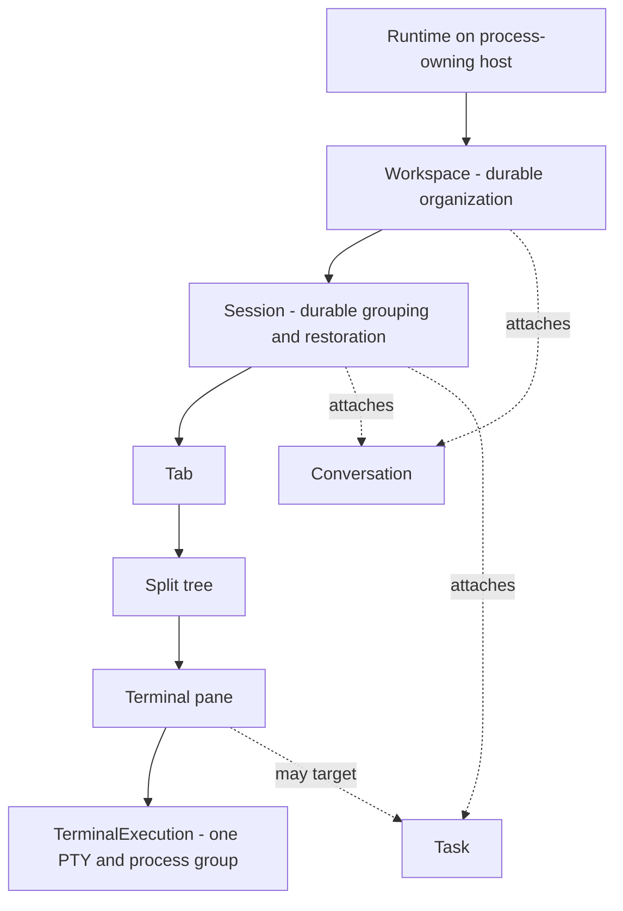
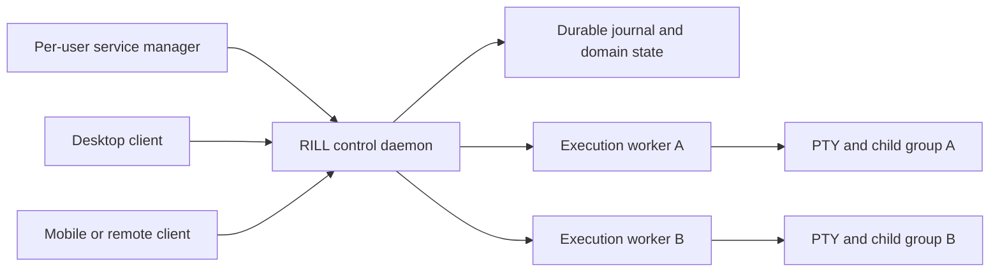
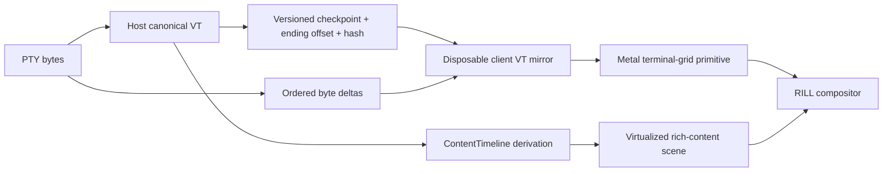

# Architecture

This file is the map. Behavior requires an Accepted ADR, a GitHub issue, a
specification and the falsifiable evidence required by
[ADR 0002](adr/0002-falsifiable-evidence.md).

Current umbrella authority:

- operating-system and PTY boundary: [ADR 0001](adr/0001-session-operating-system.md);
- display and latency evidence: [ADR 0003](adr/0003-display-pipeline.md);
- Spike 0 and M1 foundations: [ADR 0010](adr/0010-spike-0-closes.md),
  [ADR 0014](adr/0014-m1-first-slice-closes.md);
- Chip 1 isolation and future swap: [ADR 0012](adr/0012-chip1-isolated-vt.md),
  [ADR 0037](adr/0037-chip1-live-swap.md);
- product runtime, domain, content and client authority:
  [ADR 0053](adr/0053-runtime-domain-content-and-client-authority.md); and
- ADR identity/history mapping: [ADR registry](adr/README.md).

## Ownership graph

`Leaf` is internal split-tree terminology. It is not a user-facing process or
session name. Layout branches, tabs, sidebars, inspectors, rich content,
conversations and tasks own no PTY. A terminal pane owns at most one
TerminalExecution; primary and alternate screen use that same execution and
PTY.

The current kernel type named `Session` has TerminalExecution semantics. It is
not authority for a second Session meaning. Its migration is governed by
[SPEC-DOMAIN-LIFECYCLE](spec/SPEC-DOMAIN-LIFECYCLE.md).

## Runtime and failure boundaries

The runtime executes where the PTYs and child processes run. A worker owns each
PTY, canonical terminal core, monotonic offset, bounded delta recovery and
checkpoints independently of the control daemon, so daemon restart or
compatible update neither terminates healthy executions nor discards their live
terminal authority. On macOS the production lifecycle is a supported per-user
Service Management/LaunchAgent registration, not merely a detached process
launched by the GUI.

Closing a window, quitting the normal GUI, client crash, transport loss, sleep,
mobile backgrounding and lease expiry detach; they do not terminate. Host
logout/shutdown may end live processes and records that outcome. Termination is
a separate explicit, journaled and confirmable action.

## Authority and client projections

The host owns process state, canonical terminal state, offsets, checkpoints,
transcript, structured content, domain graph, tasks and client leases. A client
VT mirror initializes from a compatible checkpoint, consumes ordered deltas,
reconciles offsets and hashes, and may be discarded without losing data.

The warm path remains binary PTY bytes to an in-process client VT and POD damage
to the terminal-grid presenter. JSON, control-plane RPC and per-cell Strings are
forbidden on that path. Checkpoints are cold, compact, versioned binary state;
they are not per-frame cell IPC.

## Planes

| Plane | Owns | Must not |
|---|---|---|
| Domain/orchestration | stable IDs, Workspace, Session, Task, Conversation, attention | own PTYs, carry warm bytes, infer command boundaries |
| Runtime/kernel | service, workers, PTYs, processes, journal, canonical VT, leases | paint, trust a caller-selected identity, kill on disconnect |
| Attach/protocol | versioned frames, authentication, per-client credit, ordered bytes, checkpoints | drop live bytes, use an unattached default pane, let observers resize/write |
| Content | ContentTimeline, transcript schemas, retention and provenance | become PTY authority, treat a byte range as complete display state |
| Presentation | native UI, compositor, text, editor, selection, accessibility, terminal grid | spawn the user shell, own lifecycle/domain truth |

## Content model

Primary structured presentation uses a virtualized `ContentTimeline` with typed
terminal input/output, background output, agent conversation, tool, approval,
question, diff and lifecycle items. Terminal items retain materialized semantic
presentation and source execution ranges. Replaying a raw byte range through a
fresh VT is recovery/audit, not normal rendering.

Command boundaries require explicit marks or known structured-input submission.
Prompt regex and language heuristics are forbidden. Alternate screen remains a
mutable VT grid of the same terminal pane and is not a second PTY or a separate
timeline Block.

Durable retention is policy-controlled and may be disabled. Encryption does
not authorize capture. Redaction is a derived sink and does not claim complete
secret detection or silently rewrite source evidence.

## Compositor and internal boundaries

The existing Metal renderer remains the terminal-grid primitive inside a
broader RILL compositor for virtualized rich content, shaped text, editor,
images, controls, diffs, hit testing and accessibility. The compositor consumes
projections; it does not own Workspace, Session, Task or transcript state.

Internal ownership seams are `rill-domain`, `rill-protocol`, `rill-runtime`,
`rill-terminal-core`, `rill-text`, `rill-terminal-surface`, `rill-content`,
`rill-editor` and `rill-compositor`. They are not deployment units or public API
promises. Existing crates move only through accepted implementation specs.

## Multi-client and remote

Every connection has ClientId, authenticated device identity, role, independent
credit and view state. Exactly one controller holds the input/resize lease for
a TerminalExecution. Observers cannot write, resize or affect another client's
credit. Lease loss detaches input authority and never terminates the process.

Remote cases:

| Case | Contract |
|---|---|
| Local Mac | local runtime over protected Unix transport |
| User-owned Mac/Linux or VPS with RILL | remote host runtime is authoritative over an authenticated transport |
| Zero-footprint SSH | only the user-requested SSH session; no probing, upload, bootstrap, profile/history access or hidden commands; explicit capability downgrade |
| Enhanced SSH bootstrap | explicit opt-in and policy permission; commands/artifacts shown first; cleanup best effort and residue reported |
| iPhone/iPad | client attaches to an awake/reachable runtime; backgrounding detaches; deliberate lease takeover only |

No hosted relay or account is authorized.

## Normative specifications

- [SPEC-DOMAIN-LIFECYCLE](spec/SPEC-DOMAIN-LIFECYCLE.md)
- [SPEC-RUNTIME-SUPERVISION](spec/SPEC-RUNTIME-SUPERVISION.md)
- [SPEC-CLIENT-AUTHORITY](spec/SPEC-CLIENT-AUTHORITY.md)
- [SPEC-CONTENT](spec/SPEC-CONTENT.md)
- [SPEC-COMPOSITOR](spec/SPEC-COMPOSITOR.md)
- [SPEC-ATTACH](spec/SPEC-ATTACH.md)
- [SPEC-CHIP1](spec/SPEC-CHIP1.md)
- [SPEC-REMOTE](spec/SPEC-REMOTE.md)

## Binding dependency order

Authority/domain/lifecycle → supervised runtime and leases → host checkpoints
and reconciliation → content/transcript → compositor/text/input/selection →
remote/mobile → agent product surfaces.

Chip 1 live swap remains parked until checkpoint compatibility and disposable
mirror reconciliation are specified and demonstrated red.

## Forbidden shortcuts

- JSON or per-cell strings on the warm path
- passing the PTY master to a GUI
- GUI spawning the user's shell
- hidden UI deleting domain objects
- crash, disconnect or lease expiry interpreted as termination
- raw range replay called the native content model
- prompt-regex command boundaries
- SSH probing in zero-footprint mode
- replacing the Metal terminal-grid renderer
- using tmux, Herdr, Ghostty or WezTerm as RILL's internal multiplexer
